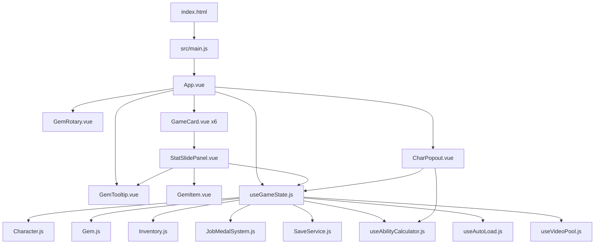

# Architectural Overview — Vantage Strike

## 1. Entry Points (HTML)

| File | Status | Purpose |
|------|--------|---------|
| [`index.html`](index.html) | ✅ Active | Main game entry → [`src/main.js`](src/main.js) → [`App.vue`](src/App.vue) |
| [`gems.html`](gems.html) | ❌ Missing (ENOENT) | Listed in [`vite.config.js`](vite.config.js:8-11) as second build input, but file doesn't exist on disk |

**Action:** Remove `gems.html` from `vite.config.js` rollupOptions. Only `index.html` should be the entry.

---

## 2. App.vue Visual Structure (What the User Sees)

```
┌─────────────────────────────────────┐
│  HEADER                             │
│  [TITLE] [GemRotary]  │  GOLD INFO │
├─────────────────────────────────────┤
│  CONTENT ROW                        │
│  ┌─────────────────────────────┐    │
│  │  Cards Scroll (6 character  │    │
│  │  objective cards, stacked)  │    │
│  │                             │    │
│  │  Each GameCard contains:    │    │
│  │  - Portrait (with badges)   │    │
│  │  - Cinematic video area     │    │
│  │  - HP bar                   │    │
│  │  - Tap to attack            │    │
│  │  - [StatSlidePanel toggle]  │    │
│  └─────────────────────────────┘    │
│  [JobMedalSidebar — v-if="false"]   │
└─────────────────────────────────────┘
Overlays (Teleported to body):
- Damage popups
- CharPopout (full detail overlay)
- GemTooltip (hover tooltip)
- LeaderboardTab overlay (no way to open)
```

### What the User Wants Visible:
1. **Title** → `VANTAGE STRIKE` (left header)
2. **Clickable rotary** → `GemRotary` (left header, cycles through characters/colors)
3. **Character gold info** → Gold display (right header)
4. **6 character objective cards** → The cards

---

## 3. Component Tree & Usage

### Actively Used Components

| Component | Used In | Lines | Purpose |
|-----------|---------|-------|---------|
| [`GameCard.vue`](src/components/GameCard.vue) | [`App.vue`](src/App.vue:153) | 544 | Character objective card with tap, HP, video, gem grid |
| [`StatSlidePanel.vue`](src/components/StatSlidePanel.vue) | [`GameCard.vue`](src/components/GameCard.vue:417) | 1266 | Slide-out stats/gems/medals panel (inside each card) |
| [`GemRotary.vue`](src/components/GemRotary.vue) | [`App.vue`](src/App.vue:136) | 115 | Clickable gem icon that cycles character focus |
| [`CharPopout.vue`](src/components/CharPopout.vue) | [`App.vue`](src/App.vue:184) | 465 | Full-screen character detail overlay |
| [`GemTooltip.vue`](src/components/GemTooltip.vue) | [`App.vue`](src/App.vue:191), [`StatSlidePanel.vue`](src/components/StatSlidePanel.vue:655) | 573 | POE-style gem tooltip |
| [`GemItem.vue`](src/components/GemItem.vue) | [`StatSlidePanel.vue`](src/components/StatSlidePanel.vue:612), [`GameCard.vue`](src/components/GameCard.vue:384) | ? | Mini gem display icon |

### Potentially Dead / Unused Components

| Component | Used In | Status |
|-----------|---------|--------|
| [`JobMedalSidebar.vue`](src/components/JobMedalSidebar.vue)  (558 lines) | [`App.vue`](src/App.vue:164) `v-if="false"` | ❌ **Dead code** — rendered with `v-if="false"`, never visible |
| [`LeaderboardTab.vue`](src/components/LeaderboardTab.vue) | [`App.vue`](src/App.vue:195) `v-if="showLeaderboardTab"` | ⚠️ **Dead code** — `showLeaderboardTab` is always `false`, no button to toggle it. Contents just say "unavailable" |
| [`GemTab.vue`](src/components/GemTab.vue) (1011 lines) | Not used anywhere in App.vue | ❌ **Dead code** — was for the old `gems.html` route |
| [`GemColorBar.vue`](src/components/GemColorBar.vue) | ? | ⚠️ Check if used anywhere |

### Dead Composables / Config

| File | Lines | Status |
|------|-------|--------|
| [`composables/useAbilityCalculator.js`](src/composables/useAbilityCalculator.js) | 150 | ⚠️ `computeAshbeamCritStats`, `computeVoltkinDamageStats`, `computeCrypsisDamageMult` are all dead — actual logic is in `useGameState.js`. Only `rollAbilityForColor()` is used (via import in `useGameState.js:19`). |
| [`composables/useAutoLoad.js`](src/composables/useAutoLoad.js) | ? | ✅ Used in `useGameState.js` for save guard |
| [`composables/useGemTooltip.js`](src/composables/useGemTooltip.js) | ? | ✅ Used by `GemTooltip.vue` and `StatSlidePanel.vue` |
| [`composables/useVideoPool.js`](src/composables/useVideoPool.js) | ? | ✅ Used for MP4 cinematic video playback |
| [`config/assetPaths.js`](src/config/assetPaths.js) | ? | ⚠️ Check if used — may be redundant with `gameData.js:localImages` |
| [`config/initialGameState.js`](src/config/initialGameState.js) | ? | ⚠️ Check if used — may be legacy |

---

## 4. Models

| File | Purpose | Status |
|------|---------|--------|
| [`Character.js`](src/models/Character.js) | Hero data class (stats, level, inventory, jobMedals) | ✅ Active |
| [`Gem.js`](src/models/Gem.js) | Gem data class (color, tier, class, modifiers) | ✅ Active |
| [`Inventory.js`](src/models/Inventory.js) | Gem inventory container | ✅ Active |
| [`JobMedal.js`](src/models/JobMedal.js) | Single medal data | ✅ Active |
| [`JobMedalSystem.js`](src/models/JobMedalSystem.js) | Medal system (10 medals per character) | ✅ Active |

---

## 5. Services

| File | Purpose | Status |
|------|---------|--------|
| [`SaveService.js`](src/services/SaveService.js) | localStorage save/load | ✅ Active |

---

## 6. External / Non-Game Files (in project root)

| File | Status |
|------|--------|
| [`server/`](server/) directory | ❌ Backend server (not part of game client) |
| [`network/`](network/) directory | ❌ ngrok tunnel setup (not game) |
| [`plans/`](plans/) directory | ❌ Plan documents (not code) |
| [`src/_replace_defs.cjs`](src/_replace_defs.cjs) | ⚠️ Build script? Check necessity |
| [`server/seed-gems.cjs`](server/seed-gems.cjs) | ❌ Server-side seed data |
| [`node_modules/`](node_modules/) | ✅ Dependencies (required) |

---

## 7. Current Issues & Recommendations

### Critical
1. **`gems.html` doesn't exist** but is referenced in [`vite.config.js`](vite.config.js:10) — will cause build failure. Remove rollupOptions entirely or keep only `index.html`.
2. **GemsApp.vue / gems-main.js** are listed as open tabs but `ENOENT` on disk — confirm they're deleted.

### Dead Code to Remove
3. **`JobMedalSidebar.vue`** — 558 lines, `v-if="false"` in `App.vue:164`. Remove import, template reference, and file.
4. **`LeaderboardTab.vue`** — 17 lines showing "unavailable", no way to open. Remove import, template, and file.
5. **`GemTab.vue`** — 1011 lines, not used anywhere. Remove file.
6. **`GemColorBar.vue`** — Verify usage. If unused, remove.
7. **`config/assetPaths.js`** — Verify if used or duplicate of `gameData.js`.
8. **`config/initialGameState.js`** — Verify if used or legacy.
9. **Dead exports in `useAbilityCalculator.js`** — `computeAshbeamCritStats`, `computeVoltkinDamageStats`, `computeCrypsisDamageMult` are not called anywhere in the active code path. Only `rollAbilityForColor()` is used.

### Non-Game Directories
10. **`server/`** and **`network/`** — These are backend/tunnel tools, not game code. Consider removing or moving outside the game project.

---

## 8. Data Flow Diagram



---

## 9. Summary of What to Keep vs Remove

### ✅ KEEP
- `index.html` (single entry)
- `App.vue` (game shell)
- `GameCard.vue` (character cards)
- `StatSlidePanel.vue` (stats/medals/gems panel)
- `GemRotary.vue` (color selector)
- `CharPopout.vue` (character details)
- `GemTooltip.vue` + `useGemTooltip.js` (tooltip)
- `GemItem.vue` (gem icon)
- `useGameState.js` (all game logic)
- All 5 models (`Character`, `Gem`, `Inventory`, `JobMedal`, `JobMedalSystem`)
- `SaveService.js`
- `useAutoLoad.js`
- `useVideoPool.js`
- `config/gameData.js`, `config/jobMedalData.js`

### ❌ REMOVE (dead code)
- `vite.config.js` rollupOptions (only need `index.html`)
- `JobMedalSidebar.vue` (v-if="false")
- `LeaderboardTab.vue` (unavailable, no toggle)
- `GemTab.vue` (orphaned from dead gems.html route)
- `GemColorBar.vue` (verify first)
- `config/assetPaths.js` (verify)
- `config/initialGameState.js` (verify)
- Dead functions in `useAbilityCalculator.js` (3 compute functions; keep `rollAbilityForColor`)
- `network/` directory
- `server/` directory
