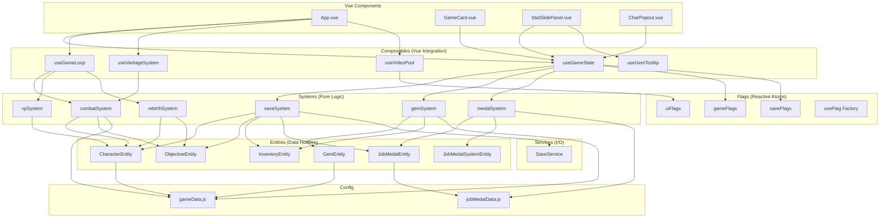

# Refactoring Plan: Entity / Composable / System / Flag Architecture

## Goal

Transform the current monolithic [`useGameState.js`](src/composables/useGameState.js) (~1652 lines containing all game logic) into a clean **Entity / Composable / System / Flag** architecture, with proper separation of concerns and real localStorage persistence.

---

## 1. Backup First

Before any code changes, create a timestamped backup of the entire project:

```
backups/
  2026-07-24/
    game-backup/
      (full project copy)
```

---

## 2. Target Directory Structure

```
src/
  entities/         ← Pure data holders (no behavior, no Vue)
    CharacterEntity.js
    GemEntity.js
    InventoryEntity.js
    ObjectiveEntity.js
    JobMedalEntity.js
    JobMedalSystemEntity.js

  composables/      ← Vue reactive integration layer
    useGameState.js      ← Slim: reactive state registry only
    useGameLoop.js       ← Game tick (setInterval → systems)
    useVantageSystem.js  ← Vantage/cinematic reactive bindings
    useGemTooltip.js     ← KEEP AS-IS (already clean)
    useVideoPool.js      ← KEEP AS-IS (already clean)
    useFlag.js           ← Generic flag factory (Zustand-like)

  systems/          ← Pure logic, ZERO Vue imports
    combatSystem.js      ← Damage calc, tap, auto-strike, crits, vantage, overcore
    medalSystem.js       ← Job medal leveling, bonuses, force
    gemSystem.js         ← Gem rolling, modifiers, DPS, equip/unequip
    xpSystem.js          ← XP gain, level-up progression
    rebirthSystem.js     ← Rebirth logic, gem award on rebirth
    saveSystem.js        ← Save/load orchestration (calls SaveService)

  flags/            ← Atomic reactive state atoms
    gameFlags.js         ← isLoaded, cheatActive, popoutHero
    saveFlags.js         ← lastSaveTime, lastSaveLabel, isSaving
    uiFlags.js           ← videoEnabled, isMobileView, viewportWidth

  config/           ← Static configuration (KEEP AS-IS)
    gameData.js
    jobMedalData.js

  services/         ← I/O layer
    SaveService.js       ← Rewritten with real localStorage + versioning

  models/           ← ⚠️ REMOVE (migrated to entities/)

  components/       ← Vue UI (KEEP AS-IS, update imports only)
    App.vue, GameCard.vue, StatSlidePanel.vue, etc.
```

---

## 3. Detailed Breakdown: Entities

### [`src/entities/CharacterEntity.js`](src/entities/CharacterEntity.js)

Strip all behavior from existing [`Character.js`](src/models/Character.js). Keep only:
- Data fields (name, level, xp, maxXp, baseVantage, grade, stats, gemSlots, inventory, jobMedals, vantageRating, mp4Index)
- `toJSON()` / `fromJSON()` serialization
- Stat merging defaults

**Remove**: No computation methods — just data.

### [`src/entities/GemEntity.js`](src/entities/GemEntity.js)

Strip computation from existing [`Gem.js`](src/models/Gem.js):
- Data fields (id, color, gemIdx, tier, level, xp, name, classId, cd, dmg, modifiers)
- `toJSON()` / `fromJSON()` serialization
- Image path resolution (simple getter)

**Extract to `gemSystem.js`**:
- `rollModifiers()` → `gemSystem.rollModifiers(gem)`
- `getModifierValue()` → `gemSystem.getModifierValue(gem, type)`
- `generateName()` → `gemSystem.generateGemName(gem)`
- `computeScaledDamage()` → `combatSystem.computeGemScaledDamage(gem, stats)`
- `getScalingStatValue()` → `combatSystem.getGemScalingStatValue(gem, stats)`
- `classDef` getter → `gemSystem.getGemClassDef(gem)`

### [`src/entities/ObjectiveEntity.js`](src/entities/ObjectiveEntity.js) — **New file**

Extract the inline `reactive({...})` object from [`createObjectiveInstance()`](src/composables/useGameState.js:486-509) into a proper entity:

```js
// Data fields only
{
  id, name, generation, grade,
  heroArmy, enemyArmyMax, enemyArmyCurrent,
  completed, totalCompletionsNeeded,
  portraitUrl, barUrl, mp4Url,
  dmgPopupTimer, combatAccumulator, autoDmgId,
  videoReady,
  totalDamageDealt
}
```

Static factory: `ObjectiveEntity.create(heroName, grade)` — no computation, just default values.

### [`src/entities/InventoryEntity.js`](src/entities/InventoryEntity.js)

Keep existing [`Inventory.js`](src/models/Inventory.js) almost as-is — it's already a clean container. Just rename and move to `entities/`.

### [`src/entities/JobMedalEntity.js`](src/entities/JobMedalEntity.js)

Strip leveling logic from existing [`JobMedal.js`](src/models/JobMedal.js):
- Data: `medalId`, `level`, `maxLevel`
- `toJSON()` / `fromJSON()`

**Extract to `medalSystem.js`**:
- `checkLevelUp()` → `medalSystem.checkMedalLevelUp(medal, heroStats)`
- `getCurrentStatValue()` → `medalSystem.getMedalStatValue(medal, heroStats)`
- `target` getter → `medalSystem.getMedalTarget(medal)`
- `getProgress()` → `medalSystem.getMedalProgress(medal, heroStats)`

### [`src/entities/JobMedalSystemEntity.js`](src/entities/JobMedalSystemEntity.js)

Strip container logic from existing [`JobMedalSystem.js`](src/models/JobMedalSystem.js):
- Data: `characterName`, `medalSlots[]`, `selectedMedalIndex`
- `toJSON()` / `fromJSON()`

**Extract to `medalSystem.js`**:
- `checkAllMedals()` → `medalSystem.checkAllMedals(system, heroStats)`
- `createForCharacter()` → `medalSystem.createMedalSet(characterName, medalDefs)`

---

## 4. Detailed Breakdown: Systems

All systems are **pure functions** — they receive data (entities) and return results. No Vue imports, no side effects (except where explicitly noted for save/load).

### [`src/systems/combatSystem.js`](src/systems/combatSystem.js)

**Extracted from [`useGameState.js`](src/composables/useGameState.js):**

| Function | Lines (approx) | Description |
|----------|---------------|-------------|
| `calculateTapDamage(hero, objective, gemBonuses)` | 643-718 | Tap damage formula with vantage, overcore, crits, damageMult |
| `calculateAutoStrikeDamage(hero, objective, gemBonuses)` | 1320-1356 | Auto-strike DPS with crits, idleDamageMult |
| `getOvercoreDmgMult(hero, overcoreBase)` | 412-417 | Exponential OC damage scaling |
| `getHeroVantage(heroName, heroes)` | 395-402 | Vantage rating computation |
| `getHeroMaxVantage(hero)` | 419-423 | Max vantage with cap boost |
| `getTotalHeroBonuses(hero)` | 302-318 | Sum gem + medal bonuses |
| `getHeroGemBonuses(hero)` | 182-261 | Sum gem bonuses only |
| `getEffectiveStats(hero, objective)` | 149-166 | Stats + Spectra gem bonuses |
| `getSpectraGemStatBonus(hero)` | 127-142 | Cyan gem stat bonus |
| `getGemDPS(gem)` | 1545-1548 | Gem damage per second |

### [`src/systems/medalSystem.js`](src/systems/medalSystem.js)

**Extracted from [`useGameState.js`](src/composables/useGameState.js) + [`JobMedal.js`](src/models/JobMedal.js) + [`JobMedalSystem.js`](src/models/JobMedalSystem.js):**

| Function | Source | Description |
|----------|--------|-------------|
| `checkAllMedals(system, heroStats)` | JobMedalSystem.js:45 | Check all 10 medals for level-ups |
| `checkMedalLevelUp(medal, heroStats)` | JobMedal.js:105 | Single medal level-up check |
| `getMedalStatValue(medal, heroStats)` | JobMedal.js:50 | Sum tracked stat values |
| `getMedalTarget(medal)` | JobMedal.js:77 | Stat points needed for next level |
| `getMedalProgress(medal, heroStats)` | JobMedal.js:91 | Progress fraction 0..1 |
| `createMedalSet(characterName, medalDefs)` | JobMedalSystem.js:27 | Factory for 10 medals |
| `getJobMedalBonuses(medal)` | useGameState.js:380 | Medal passive bonuses |
| `selectJobMedal(heroName, slotIndex, heroes)` | useGameState.js:272 | Focus a medal slot |

### [`src/systems/gemSystem.js`](src/systems/gemSystem.js)

**Extracted from [`useGameState.js`](src/composables/useGameState.js) + [`Gem.js`](src/models/Gem.js):**

| Function | Source | Description |
|----------|--------|-------------|
| `rollModifiers(gem)` | Gem.js:65 | Roll random affixes |
| `getModifierValue(gem, type)` | Gem.js:100 | Sum modifier of type |
| `hasModifier(gem, type)` | Gem.js:114 | Check modifier existence |
| `generateGemName(gem)` | Gem.js:221 | Generate display name |
| `getGemClassDef(gem)` | Gem.js:125 | Resolve class definition |
| `rollAbilityForColor()` | useAbilityCalculator.js:123 | Weighted random class roll |
| `autoDismantleGems(keepCount, heroes)` | useGameState.js:1556 | Prune weak gems |
| `autoEquipGems(heroes)` | useGameState.js:971 | Auto-fill slots |
| `autoEquipCharGems(heroName, heroes)` | useGameState.js:1594 | Per-hero auto-equip |
| `equipGem(heroName, slotIndex, gemId, heroes)` | useGameState.js:1123 | Equip gem to slot |
| `unequipGem(heroName, slotIndex, heroes)` | useGameState.js:1146 | Unequip from slot |
| `moveGem(from, fromSlot, to, toSlot, heroes)` | useGameState.js:1112 | Drag-drop gem |
| `deleteGem(gemId, heroes)` | useGameState.js:1016 | Delete gem entirely |

### [`src/systems/xpSystem.js`](src/systems/xpSystem.js)

**Extracted from [`useGameState.js`](src/composables/useGameState.js):**

| Function | Source | Description |
|----------|--------|-------------|
| `addXP(hero, amount)` | useGameState.js:528 | Add XP, handle level-ups |
| `getXpForLevel(level)` | useGameState.js:535 | XP requirement formula |

### [`src/systems/rebirthSystem.js`](src/systems/rebirthSystem.js)

**Extracted from [`useGameState.js`](src/composables/useGameState.js):**

| Function | Source | Description |
|----------|--------|-------------|
| `processRebirth(objId, state)` | useGameState.js:776 | Rebirth flow |
| `computeStartingArmy(heroName, grade)` | useGameState.js:432 | Starting force |
| `computeGemForceGain(hero, objective)` | useGameState.js:443 | Force from gems |
| `getBaseEnemyMax(grade)` | useGameState.js:459 | Enemy HP formula |
| `getEnemyMaxForCompletion(grade, completed)` | useGameState.js:463 | Scaled enemy HP |
| `getTotalForRebirth(grade, lastStage)` | useGameState.js:471 | Completions needed |

### [`src/systems/saveSystem.js`](src/systems/saveSystem.js)

**Extracted from [`useGameState.js`](src/composables/useGameState.js) — orchestration only:**

| Function | Source | Description |
|----------|--------|-------------|
| `saveGame(state, heroes)` | useGameState.js:1155 | Serialize + persist |
| `loadGame()` | useGameState.js:1227 | Load + restore |
| `saveGemChanges()` | useGameState.js:1220 | Gem-specific save |

This system calls [`SaveService`](src/services/SaveService.js) for actual I/O but handles the serialization/deserialization of entities.

---

## 5. Detailed Breakdown: Flags

Flags are **atomic reactive state atoms** — inspired by Zustand's `create()` pattern but using Vue's `ref`/`reactive`. Each flag file is a tiny standalone module.

### [`src/flags/useFlag.js`](src/flags/useFlag.js) — Generic Factory

```js
// Factory function that creates a flag atom
import { ref, readonly } from 'vue'

export function createFlag(initialValue) {
  const state = ref(initialValue)
  return {
    get value() { return state.value },
    set value(v) { state.value = v },
    readonly: readonly(state)
  }
}
```

### [`src/flags/gameFlags.js`](src/flags/gameFlags.js)

```js
import { createFlag } from './useFlag.js'

export const isLoaded = createFlag(false)
export const cheatActive = createFlag(false)
export const popoutHero = createFlag(null)
export const showSettings = createFlag(false)
```

### [`src/flags/saveFlags.js`](src/flags/saveFlags.js)

```js
import { ref } from 'vue'

export const lastSaveTime = ref(null)
export const lastSaveLabel = ref('')
export const isSaving = ref(false)
```

### [`src/flags/uiFlags.js`](src/flags/uiFlags.js)

```js
import { ref, computed } from 'vue'
import { createFlag } from './useFlag.js'

export const viewportWidth = ref(window.innerWidth)
export const isMobileView = computed(() => viewportWidth.value < 600)
export const videoEnabled = createFlag(true)  // synced from localStorage
```

---

## 6. Detailed Breakdown: Composables (Refactored)

### [`src/composables/useGameState.js`](src/composables/useGameState.js) — **Slimmed Down**

**Before**: ~1652 lines — state + all game logic + formatting + save/load orchestration

**After**: ~200 lines — only:
- `heroRegistry` — reactive registry of CharacterEntity instances
- `gameState` — reactive game state object (gold, rebirthStones, objectives, etc.)
- `formatNotation()` — UI formatting helper (needs to stay for components)
- `getHPGradientColor()` — UI helper for HP bar coloring
- Re-exports from systems, flags, and entities

### [`src/composables/useGameLoop.js`](src/composables/useGameLoop.js) — **New**

Extract all game loop logic:
- `startGameLoop()` — creates `setInterval(GAME_TICK_MS)`
- `stopGameLoop()` — clears interval
- `gameTick()` — calls into systems: combat → xp → medal → save

### [`src/composables/useVantageSystem.js`](src/composables/useVantageSystem.js) — **New**

Reactive wrappers around vantage-related operations:
- `triggerCinematicMP4(obj)` with timer management
- `isCinematicActive(objId)` 
- `vantage99All()` cheat

### OTHER COMPOSABLES (Keep As-Is)

- [`useGemTooltip.js`](src/composables/useGemTooltip.js) — Already clean, just update imports
- [`useVideoPool.js`](src/composables/useVideoPool.js) — Already clean, just update imports

---

## 7. SaveService Rewrite

### [`src/services/SaveService.js`](src/services/SaveService.js)

**Before**: All no-ops (returns null, no persistence)

**After**: Real localStorage persistence:

```js
const STORAGE_KEY = 'shadow_blade_save'
const CURRENT_VERSION = 3

// Full game data save
async function saveGame(gameData) {
  const payload = {
    version: CURRENT_VERSION,
    updatedAt: Date.now(),
    data: gameData
  }
  localStorage.setItem(STORAGE_KEY, JSON.stringify(payload))
  return true
}

// Full game data load
async function loadGame() {
  const raw = localStorage.getItem(STORAGE_KEY)
  if (!raw) return null
  const payload = JSON.parse(raw)
  // Handle version migration if needed
  return payload.data
}

// Metadata-only read (for save timestamp)
async function getSaveMeta() {
  const raw = localStorage.getItem(STORAGE_KEY)
  if (!raw) return null
  const { version, updatedAt } = JSON.parse(raw)
  return { version, updatedAt }
}
```

---

## 8. Dependency Flow Diagram



---

## 9. Execution Order

Each step is designed to be a **safe, incremental refactoring** where the game remains functional after each step (except where noted).

### Phase 1: Backup & Foundation
| Step | Action | Files Changed |
|------|--------|---------------|
| 1.1 | Create `backups/2026-07-24/` full project copy | New directory |
| 1.2 | Create `src/flags/useFlag.js` — generic flag factory | New file |
| 1.3 | Create `src/flags/gameFlags.js` — game state atoms | New file |
| 1.4 | Create `src/flags/saveFlags.js` — save state atoms | New file |
| 1.5 | Create `src/flags/uiFlags.js` — UI state atoms | New file |

### Phase 2: Entities (Pure Data)
| Step | Action | Files Changed |
|------|--------|---------------|
| 2.1 | Create `src/entities/CharacterEntity.js` — strip behavior from models/Character.js | New file |
| 2.2 | Create `src/entities/GemEntity.js` — strip behavior from models/Gem.js | New file |
| 2.3 | Create `src/entities/InventoryEntity.js` — move from models/Inventory.js | New file |
| 2.4 | Create `src/entities/ObjectiveEntity.js` — extract inline reactive() object | New file |
| 2.5 | Create `src/entities/JobMedalEntity.js` — strip leveling from models/JobMedal.js | New file |
| 2.6 | Create `src/entities/JobMedalSystemEntity.js` — strip container logic | New file |

### Phase 3: Systems (Pure Logic)
| Step | Action | Files Changed |
|------|--------|---------------|
| 3.1 | Create `src/systems/combatSystem.js` — damage, crits, vantage, overcore | New file |
| 3.2 | Create `src/systems/medalSystem.js` — medal leveling, bonuses, force | New file |
| 3.3 | Create `src/systems/gemSystem.js` — gem rolling, modifiers, equip/unequip | New file |
| 3.4 | Create `src/systems/xpSystem.js` — XP gain, level-up logic | New file |
| 3.5 | Create `src/systems/rebirthSystem.js` — rebirth processing | New file |
| 3.6 | Create `src/systems/saveSystem.js` — save/load orchestration | New file |

### Phase 4: SaveService Rewrite
| Step | Action | Files Changed |
|------|--------|---------------|
| 4.1 | Rewrite `src/services/SaveService.js` with real localStorage persistence | Modified file |

### Phase 5: Composables Slim-Down
| Step | Action | Files Changed |
|------|--------|---------------|
| 5.1 | Create `src/composables/useGameLoop.js` — extract game tick loop | New file |
| 5.2 | Create `src/composables/useVantageSystem.js` — extract vantage logic | New file |
| 5.3 | Slim down `src/composables/useGameState.js` — remove logic, keep reactive wiring | Modified file |

### Phase 6: Import Updates & Cleanup
| Step | Action | Files Changed |
|------|--------|---------------|
| 6.1 | Update all component imports (App.vue, GameCard.vue, StatSlidePanel, etc.) | All .vue files |
| 6.2 | Remove old `src/models/` directory | Delete directory |
| 6.3 | Update `useAbilityCalculator.js` — keep only `rollAbilityForColor()` | Modified file |
| 6.4 | Verify `npm run build` succeeds | Build check |

---

## 10. Risk Assessment & Mitigation

| Risk | Impact | Mitigation |
|------|--------|------------|
| Broken imports during migration | Game won't build | Do Phase 6 last, after all new files exist |
| Circular dependencies between systems | Runtime errors | Systems import entities + config only, never other systems or composables |
| Save data format change | Player data loss | Version field in SaveService + migration path |
| Reactive tracking breaks | UI doesn't update | Keep reactive() wrappers in composables; systems operate on raw entity data |
| Lost functionality | Feature regression | Compare old useGameState.js against new systems line by line |

### Key Architectural Rules

1. **Systems NEVER import Vue** — no `ref`, `reactive`, `computed`, `watch`
2. **Systems NEVER import other systems** — they receive data as arguments
3. **Entities are plain objects/classes** — no `reactive()`, no methods that mutate game state
4. **Composables bridge systems to Vue** — they call system functions and update reactive state
5. **Flags are the single source of truth** for boolean/atomic game state
6. **SaveService is the only I/O layer** — systems call saveSystem which calls SaveService
