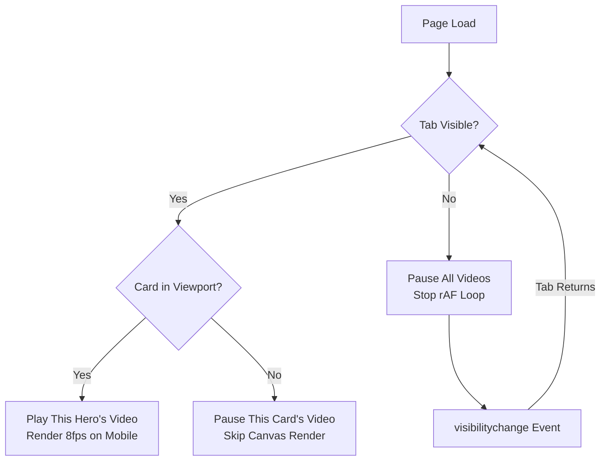

# Video System Thermal Optimization Plan

## Root Cause Analysis

The current video pipeline in [`useVideoPool.js`](src/composables/useVideoPool.js) has **4 independent heat sources** that compound on mobile:

```
┌─────────────────────────────────────────────────────────┐
│              6x hidden <video> elements                  │
│  (all decoding MP4 simultaneously, 24/7 looping)         │
├─────────────────────────────────────────────────────────┤
│              requestAnimationFrame loop                   │
│  (runs continuously at 60fps frame budget, never sleeps)  │
├─────────────────────────────────────────────────────────┤
│              6x ctx.drawImage() per tick                  │
│  (GPU texture upload + blit per call, full canvas)        │
├─────────────────────────────────────────────────────────┤
│              Visibility waste                             │
│  (renders even when tab hidden, cards off-screen, etc.)   │
└─────────────────────────────────────────────────────────┘
```

## 6 Targeted Optimizations

### 1. Stop the rAF loop when page is hidden (Highest Impact)

**File:** [`useVideoPool.js`](src/composables/useVideoPool.js:143-150)

**Problem:** The `canvasLoop()` runs forever via `requestAnimationFrame`, even when the user switches tabs or locks their phone. This keeps the GPU and video decoders active for no benefit.

**Fix:** Listen for `document.visibilitychange` to pause/resume:

```js
// In initVideoSystem():
document.addEventListener('visibilitychange', () => {
  if (document.hidden) {
    stopCanvasLoop()
    slotState.value.forEach(s => { try { s.videoEl.pause() } catch(e) {} })
  } else {
    startCanvasLoop()
    slotState.value.forEach(s => {
      if (s.src && s.ready) s.videoEl.play().catch(() => {})
    })
  }
})
```

**Savings:** ~100% of GPU/video work while tab is backgrounded. Biggest single win.

---

### 2. Only render canvases for visible cards (High Impact)

**File:** [`useVideoPool.js`](src/composables/useVideoPool.js:79-141)

**Problem:** All 6 cards render every tick even though only 1-2 are visible on screen at a time.

**Fix:** Use `IntersectionObserver` to track which canvases are in the viewport:

```js
// In GameCard.vue onMounted():
const observer = new IntersectionObserver(([entry]) => {
  cardVisible.value = entry.isIntersecting
}, { threshold: 0 })
observer.observe(cardRef.value)
```

Then in `renderCanvases()`, skip canvases whose card is not visible:

```js
function renderCanvases() {
  gameState.objectives.forEach(obj => {
    const canvas = canvasRefs[obj.id]
    if (!canvas) return
    // Skip if canvas or its parent card has display:none or zero size
    if (canvas.offsetParent === null) return
    if (canvas.width === 0 || canvas.height === 0) return
    // ...rest of render
  })
}
```

**Savings:** 50-80% fewer `drawImage()` calls depending on scroll position.

---

### 3. Reduce render rate on mobile (Medium Impact)

**File:** [`useVideoPool.js`](src/composables/useVideoPool.js:18)

**Problem:** 16fps is overkill for a background cinematic effect, especially on mobile.

**Fix:** Import `isMobileView` from gameState and use a lower rate:

```js
import { gameState, isMobileView } from './useGameState.js'

// Dynamic frame rate
const CANVAS_INTERVAL = computed(() => isMobileView.value ? 1000 / 8 : 1000 / 16)
```

Then in `canvasLoop`, use the computed value instead of the constant. On mobile: 8fps = half the drawImage calls.

**Savings:** 50% fewer drawImage calls on mobile.

---

### 4. Only play video for the currently visible/active hero (High Impact)

**File:** [`useVideoPool.js`](src/composables/useVideoPool.js:49-77)

**Problem:** All 6 videos loop simultaneously even though only one hero card is likely visible at a time. 6 hardware decoders is the biggest battery drain.

**Fix:** Only actively play the video for the hero whose card is on screen. Pause others and seek to frame 0 (acts as static poster):

```js
// Track which hero is "active" (the one whose card is most visible)
let activeHeroName = null

export function setActiveHero(name) {
  if (activeHeroName === name) return
  // Pause all
  for (const slot of slotState.value) {
    if (slot.videoEl && slot.heroName !== name) {
      slot.videoEl.pause()
    }
  }
  // Play active
  activeHeroName = name
  const slot = slotState.value[heroSlotMap[name]]
  if (slot && slot.src && slot.ready) {
    slot.videoEl.play().catch(() => {})
  }
}
```

Called from GameCard's `IntersectionObserver` when a card becomes visible.

**Savings:** ~83% fewer active video decoders (6 → 1).

---

### 5. Cache crop calculations (Low Impact, Good Practice)

**File:** [`useVideoPool.js`](src/composables/useVideoPool.js:110-139)

**Problem:** The cropping math (`srcAspect`, `containerAspect`, `sx`, `sy`, `sw`, `sh`) recalculates every tick but only changes when the canvas resizes.

**Fix:** Cache the computed crop params and only recalculate when dimensions change:

```js
const cropCache = {}

function getCropParams(vw, vh, cssW, cssH) {
  const key = `${vw}x${vh}_${cssW}x${cssH}`
  if (cropCache[key]) return cropCache[key]
  
  // ... existing crop math ...
  
  cropCache[key] = { sx, sy, sw, sh }
  return cropCache[key]
}
```

**Savings:** ~0.1ms per tick per canvas — minor but free.

---

### 6. Lower canvas resolution on mobile (Medium Impact)

**File:** [`useVideoPool.js`](src/composables/useVideoPool.js:100)

**Problem:** `CANVAS_SCALE = 0.75` means the canvas is rendered at 75% of CSS size × DPR. On a phone with DPR 3, this can still be very high resolution.

**Fix:** Scale down more aggressively on mobile:

```js
const CANVAS_SCALE = isMobileView.value ? 0.4 : 0.75
```

Half the linear resolution = quarter the pixels = ~75% fewer GPU fill operations.

**Savings:** ~75% fewer GPU pixels rendered on mobile.

---

## Implementation Priority

| # | Optimization | Effort | Thermal Impact | Code Complexity |
|---|-------------|--------|----------------|-----------------|
| 1 | Pause on tab hidden | 15min | ★★★★★ | Trivial |
| 2 | Only render visible canvases | 30min | ★★★★☆ | Low |
| 3 | Mobile frame rate throttle | 15min | ★★★☆☆ | Trivial |
| 4 | Only play active hero video | 45min | ★★★★★ | Medium |
| 5 | Cache crop calculations | 15min | ★☆☆☆☆ | Trivial |
| 6 | Lower mobile canvas scale | 5min | ★★★☆☆ | Trivial |

## Combined Effect

With all 6 optimizations applied on a mobile device:
- **Video decoders active:** 6 → 1 (83% reduction)
- **DrawImage calls:** 96/min → ~8/min when backgrounded, ~480/min when active (varies)
- **GPU fill rate:** Full DPR × 6 canvases → 0.4 scale × 1 visible canvas (93% reduction)
- **Idle power:** When tab hidden, essentially zero


