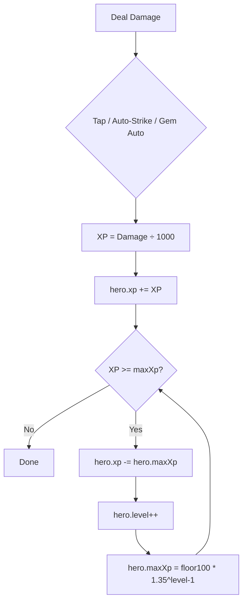

# XP & Level Up Logic

## Core Function: `addXP(heroName, amount)`

**Location:** [`src/composables/useGameState.js:566`](../src/composables/useGameState.js:566)

```js
export function addXP(heroName, amount) {
  const hero = heroRegistry[heroName]
  if (!hero) return
  hero.xp += amount
  while (hero.xp >= hero.maxXp) {
    hero.xp -= hero.maxXp
    hero.level++
    hero.maxXp = Math.floor(100 * Math.pow(1.35, hero.level - 1))
  }
}
```

**Behavior:**
- Adds `amount` to `hero.xp`
- While `xp >= maxXp`: subtracts `maxXp`, increments `level`, recalculates `maxXp` via exponential formula
- Supports **multi-level-up** in a single award via the `while` loop

## XP Requirement Formula

```
maxXp = floor(100 × 1.35^(level - 1))
```

| Level | XP Required |
|-------|-------------|
| 1 → 2 | 100 |
| 2 → 3 | 135 |
| 3 → 4 | 182 |
| 4 → 5 | 245 |
| 5 → 6 | 332 |
| 10    | ~2,040 |
| 20    | ~39,000 |
| 30    | ~745,000 |

## XP Sources (all use `Damage ÷ 1000`)

| Source | Location | XP |
|--------|----------|----|
| Tap damage | `tapObjective()` line 747 | `dmg / 1000` |
| Gem auto-damage | `gameTick()` line 1427 | `totalGemDmg / 1000` |
| Auto-strike (1/sec) | `gameTick()` line 1454 | `autoDmg / 1000` |

## Character Defaults

From [`Character` constructor](../src/models/Character.js:30-33):
```js
this.level = 1
this.xp = 0
this.maxXp = 100
```

## UI Display

- **XP bar:** [`GameCard.vue:228-230`](../src/components/GameCard.vue:228) — `hero.xp / hero.maxXp * 100%`
- **Level display:** [`GameCard.vue:244-246`](../src/components/GameCard.vue:244) — `LV <level>`
- **Level + Grade:** [`CharPopout.vue:88`](../src/components/CharPopout.vue:88) — `LV <level> · Grade <grade>`

## Cheat: `lvlPlusOneAll`

From [`useGameState.js:958`](../src/composables/useGameState.js:958):
```js
export function lvlPlusOneAll() {
  charTemplates.forEach(name => {
    const hero = heroRegistry[name]
    if (!hero) return
    hero.level++
    hero.maxXp = Math.floor(100 * Math.pow(1.35, hero.level - 1))
  })
}
```

## Flow Diagram


