# Character Profile Webpage — Plan

> **Status:** Planning draft. Intel fields marked ⬜ TBD are waiting on user-supplied lore.
> **Data sources:** `src/config/gameData.ts`, `src/config/jobMedalData.ts`, `src/composables/cssScripts.ts`, `src/templatecss.css`, `src/types.ts`, `src/components/CharPopout.vue`.

---

## 1. Context & Assumptions

- **Goal:** A profile webpage presenting the 6 playable Vantage Strike heroes, themed per character using the existing Z design system.
- **No lore exists in the repo yet.** Everything below is gameplay-derived intel from current configs. Backstory/personality/quote/relationship fields are ⬜ TBD and will be filled by the user in a later pass.
- **Page form:** A Vue page inside the existing Vite app (`apps/vantage-strike`). The app has **no vue-router** — views are toggled via `v-if` flags in `App.vue` (same pattern as `GalleryOverlay`, `TutorialOverlay`, `SettingsOverlay`).
- **Theming:** Use `[data-faction]` + `--hero-color / --hero-bright / --hero-glow` via `applyTheme()` from `cssScripts.ts`. Components must import colors from `heroThemes` — no raw hex literals.
- **Conventions (AGENTS.md):** TypeScript only; extensionless imports; reuse `.z-btn`, `.z-pbar`, `.z-badge` primitives from `templatecss.css`; no dynamic union-key assignment on mixed arrays; Windows-safe commands only.

---

## 2. Character Roster

| # | Character | Faction Title | Gem Color | Archetype | Primary Stat(s) |
|---|---|---|---|---|---|
| 1 | **Voltkin** | Voltkin's Vanguard | `reds` | Vanguard — Aggression (vantage synergy, crit amplification) | Str |
| 2 | **Ashbeam** | Ashbeam's Tactician | `blues` | Tactician — Precision (crit chance, vantage crit, support) | Dex |
| 3 | **Crypsis** | Crypsis's Rogue | `oranges` | Rogue — Trickster (final damage %, stat growth) | Dex / Int |
| 4 | **Spectra** | Spectra's Mystic | `cyans` | Mystic — Growth (stat gain, XP, per-vantage/per-army scaling) | Int / Spi |
| 5 | **Hellshift** | Hellshift's Brawler | `purples` | Brawler — Sustain (army growth, per-army stats) | Str / Con |
| 6 | **Kailin** | Kailin's Executor | `blacks` | Executor — Endgame (stat growth, idle damage, vantage cap) | total |

All 6 share the same five stat block: **Str, Spi, Int, Con, Dex** (defaults 5/5/5/5/5, default preferred `['Str','Dex']`).

---

## 3. Per-Character Profiles

### 3.1 Voltkin — "Voltkin's Vanguard"

- **Gem color:** `reds` | **Theme:** `#ef4444` / bright `#fca5a5` / glow `rgba(239,68,68,.6)`
- **Archetype:** Vanguard — aggression, vantage synergy, crit amplification. Scales with **Str**.
- **Signature class:** **Vanguard** — *"Spearhead of the assault. Vantage builds faster and army swells with each blow."* (`vantagePerTap: 1`, `armyPerSecond: 2`)
- **Job medals (10):** Vanguard · Berserker · Blademaster · Fury · Ravager · Tempest · Inferno · Warlord · Onslaught · Overlord
- **Assets:** 23 portraits · 23 bars · 10 cinematic MP4s (`assets/Voltkin_Portraits/`, `assets/Voltkin_Bars/`, `assets/Starred/Voltkin_Starred/`)
- **Art preview:**

  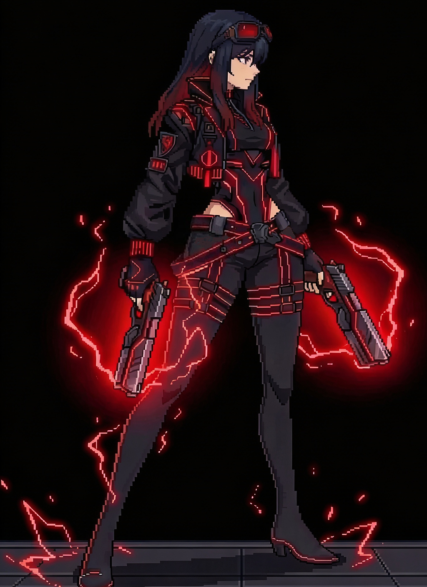
  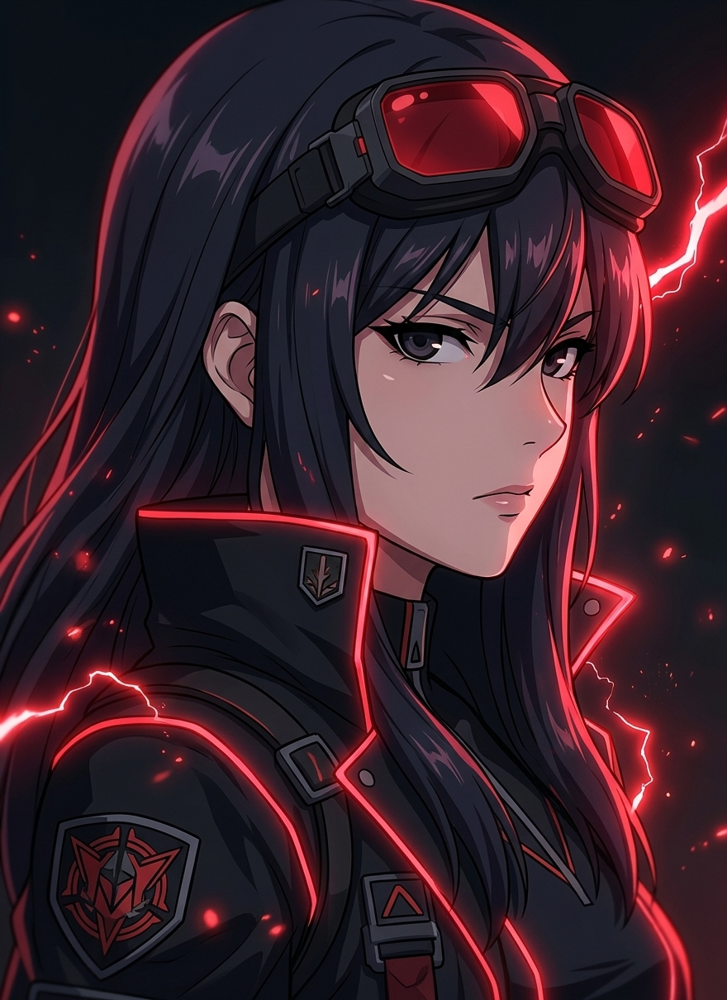
  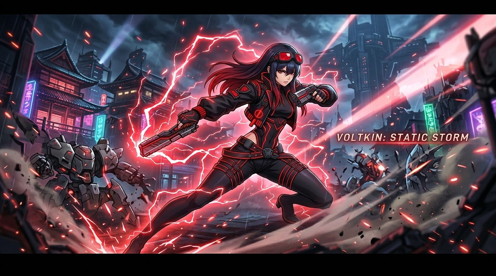

  - Standalone: [`assets/Voltkin.jpg`](../apps/vantage-strike/public/assets/Voltkin.jpg)
  - Portrait: [`assets/Voltkin_Portraits/p_1778866771799.png`](../apps/vantage-strike/public/assets/Voltkin_Portraits/p_1778866771799.png)
  - Scene bar: [`assets/Voltkin_Bars/scene_1778877404137.png`](../apps/vantage-strike/public/assets/Voltkin_Bars/scene_1778877404137.png)
- **Intel:**
  - ⬜ Backstory:
  - ⬜ Personality:
  - ⬜ Quotes:
  - ⬜ Relationships:
  - ⬜ Combat-style narrative:

### 3.2 Ashbeam — "Ashbeam's Tactician"

- **Gem color:** `blues` | **Theme:** `#3b82f6` / bright `#93c5fd` / glow `rgba(59,130,246,.6)`
- **Archetype:** Tactician — precision, crit chance, vantage crit, support. Scales with **Dex**.
- **Signature class:** **Tactician** — *"Calculates every angle. Boosts crit chance and precise vantage strikes."* (`critChance: [10,15]`, `vantageCritChance: [5,10]`)
- **Job medals (10):** Tactician · Ranger · Gunslinger · Spotter · Sharpshooter · Strategist · Patrol · Falcon · Scope · Ace
- **Assets:** 25 portraits · 23 bars · 10 cinematic MP4s (`assets/Ashbeam_Portraits/`, `assets/Ashbeam_Bars/`, `assets/Starred/Ashbeam_Starred/`); standalone JPG `assets/Ashbeam.jpg`
- **Art preview:**

  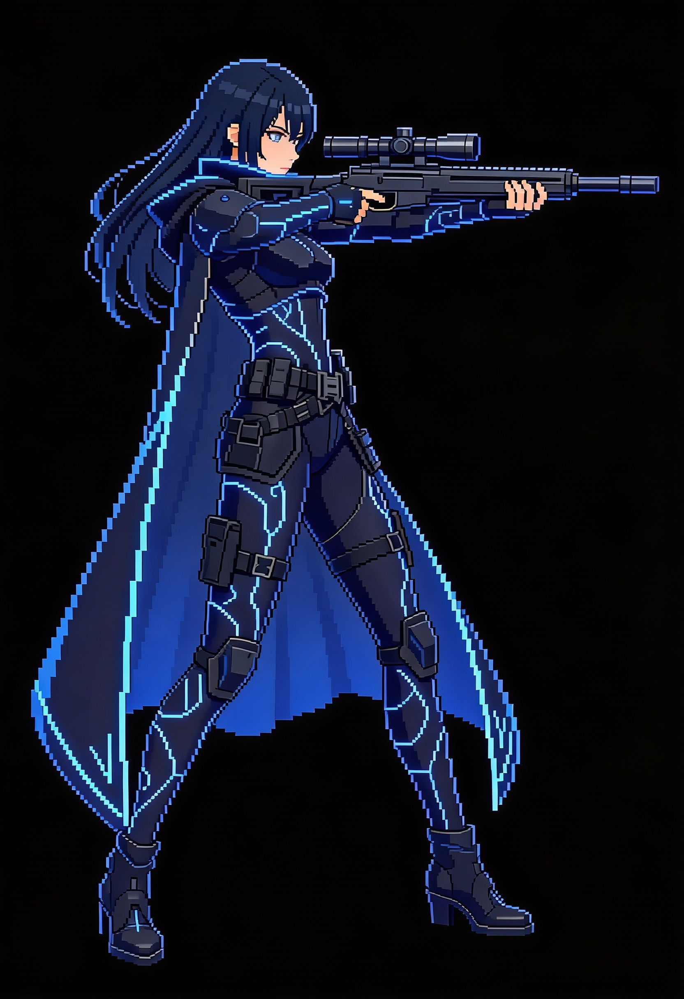
  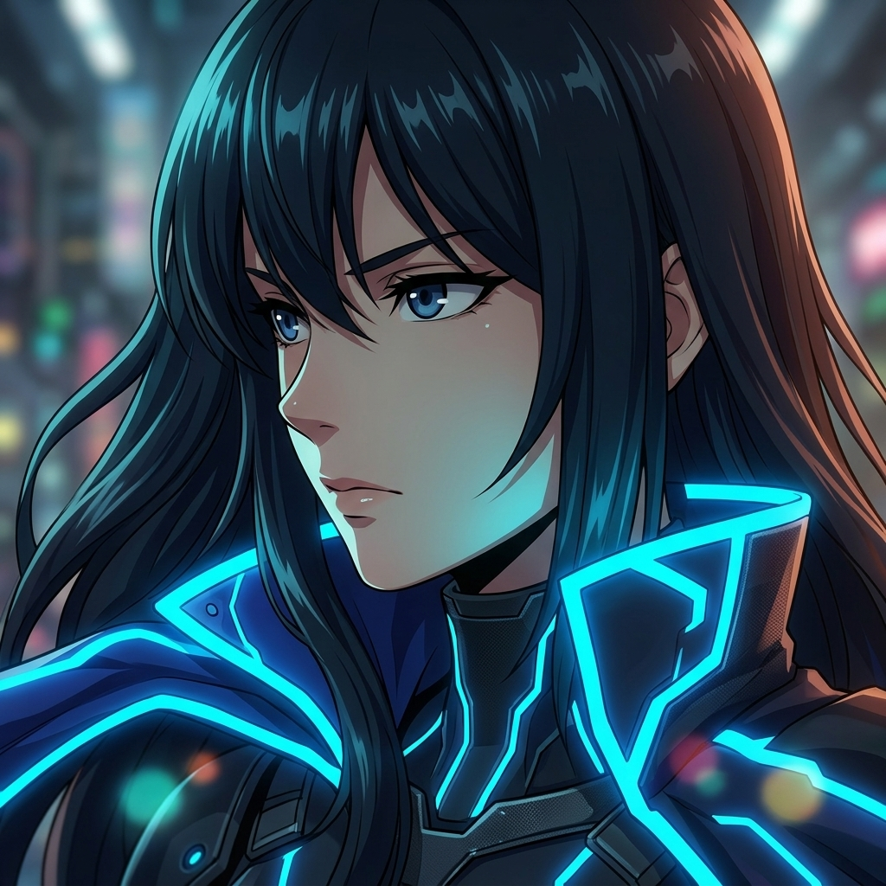
  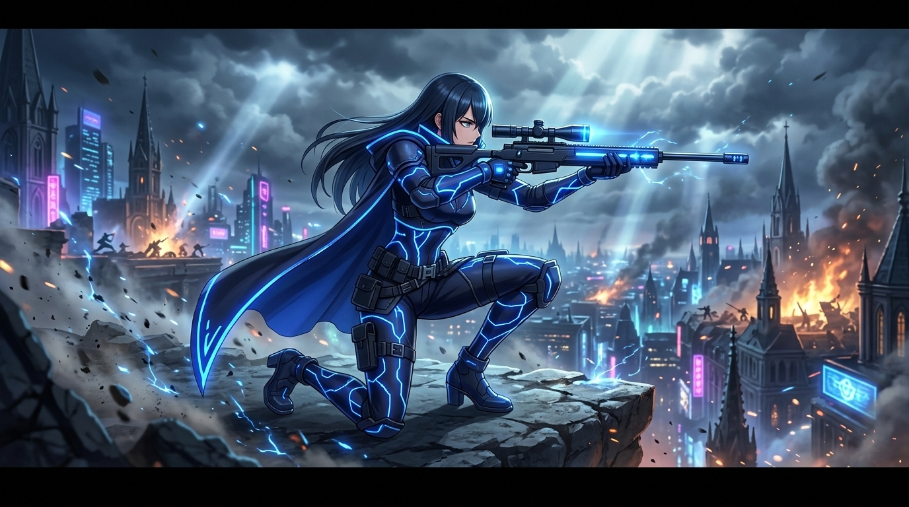

  - Standalone: [`assets/Ashbeam.jpg`](../apps/vantage-strike/public/assets/Ashbeam.jpg)
  - Portrait: [`assets/Ashbeam_Portraits/p_1778866663977.png`](../apps/vantage-strike/public/assets/Ashbeam_Portraits/p_1778866663977.png)
  - Scene bar: [`assets/Ashbeam_Bars/scene_1778877262133.png`](../apps/vantage-strike/public/assets/Ashbeam_Bars/scene_1778877262133.png)
- **Intel:**
  - ⬜ Backstory:
  - ⬜ Personality:
  - ⬜ Quotes:
  - ⬜ Relationships:
  - ⬜ Combat-style narrative:

### 3.3 Crypsis — "Crypsis's Rogue"

- **Gem color:** `oranges` | **Theme:** `#f59e0b` / bright `#fde68a` / glow `rgba(245,158,11,.6)`
- **Archetype:** Rogue — trickster, final damage %, stat growth. Scales with **Dex / Int**.
- **Signature class:** **Rogue** — *"Strikes from the shadows. Bonus final damage and stats per completion."* (`statPerCompletion: 0.015`)
- **Job medals (10):** Rogue · Assassin · Trickster · Scout · Bandit · Shadowblade · Poacher · Marauder · Swashbuckler · Corsair · Shadow King
- **Assets:** 22 portraits · 27 bars · 10 cinematic MP4s (`assets/Crypsis_Portraits/`, `assets/Crypsis_Bars/`, `assets/Starred/Crypsis_Starred/`); standalone JPG `assets/Crypsis.jpg`
- **Art preview:**

  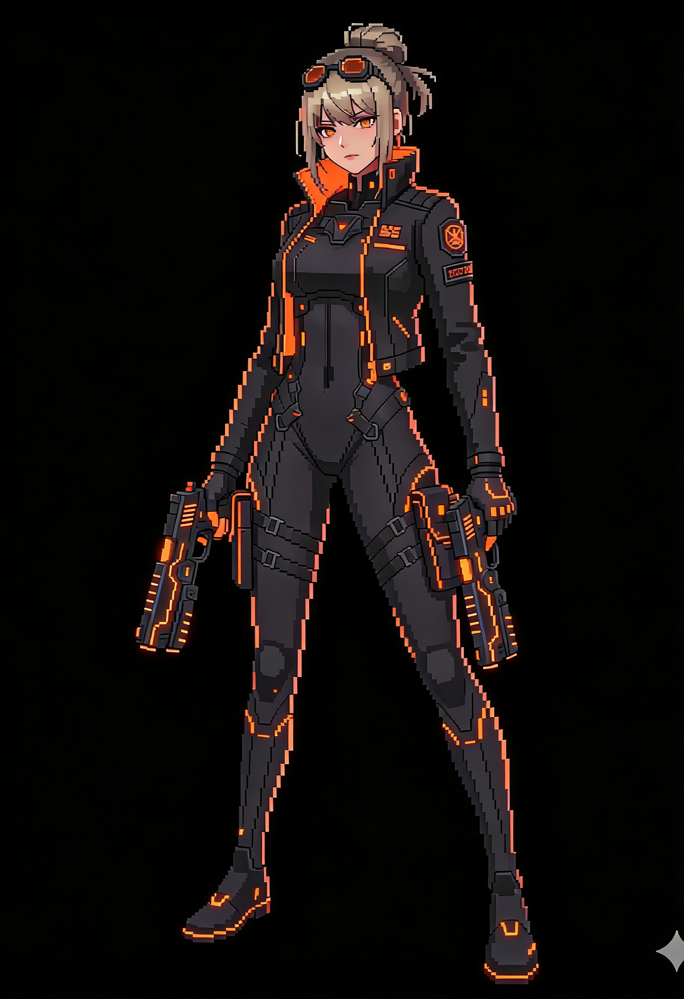
  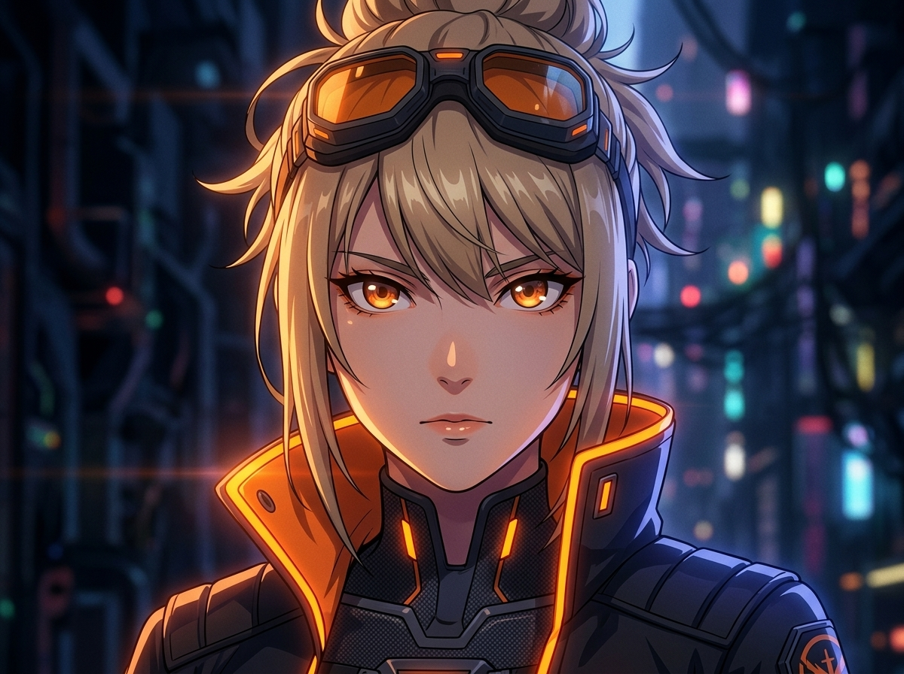
  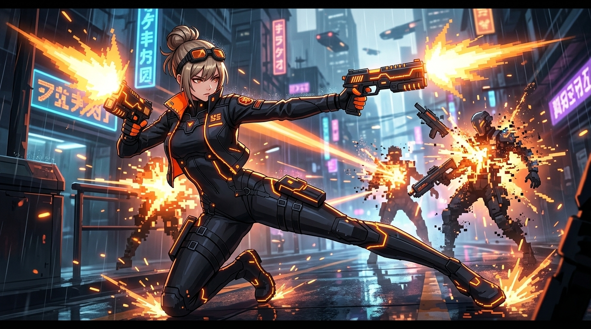

  - Standalone: [`assets/Crypsis.jpg`](../apps/vantage-strike/public/assets/Crypsis.jpg)
  - Portrait: [`assets/Crypsis_Portraits/p_1778866681842.png`](../apps/vantage-strike/public/assets/Crypsis_Portraits/p_1778866681842.png)
  - Scene bar: [`assets/Crypsis_Bars/scene_1778877291672.png`](../apps/vantage-strike/public/assets/Crypsis_Bars/scene_1778877291672.png)
- **Intel:**
  - ⬜ Backstory:
  - ⬜ Personality:
  - ⬜ Quotes:
  - ⬜ Relationships:
  - ⬜ Combat-style narrative:

### 3.4 Spectra — "Spectra's Mystic"

- **Gem color:** `cyans` | **Theme:** `#22d3ee` / bright `#a5f3fc` / glow `rgba(34,211,238,.6)`
- **Archetype:** Mystic — growth, stat gain, XP, per-vantage/per-army scaling. Scales with **Int / Spi**.
- **Signature class:** **Mystic** — *"Attuned to arcane forces. Bonus stats per completion and faster growth."* (`statPerCompletion: 0.02`)
- **Job medals (10):** Mystic · Arcanist · Enchanter · Sage · Oracle · Aegis · Seer · Weaver · Luminary · Archon
- **Assets:** 21 portraits · 20 bars · 10 cinematic MP4s (`assets/Spectra_Portraits/`, `assets/Spectra_Bars/`, `assets/Starred/Spectra_Starred/`)
- **Art preview:**

  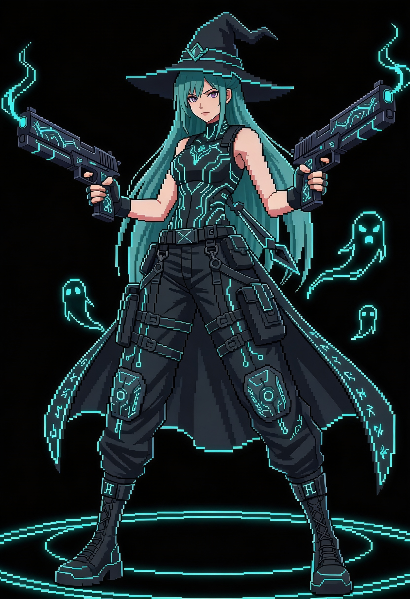
  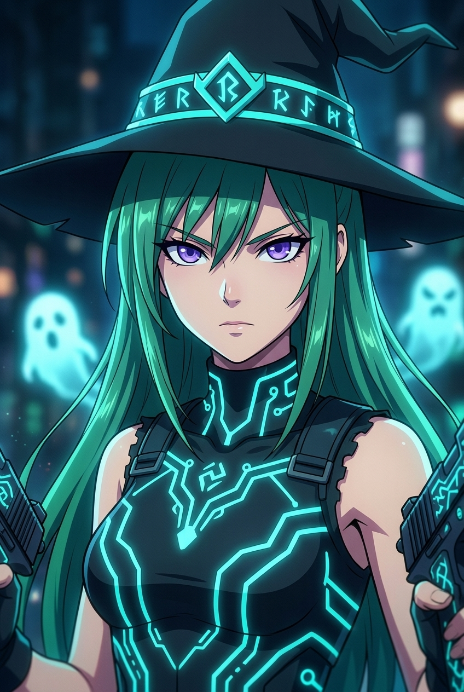
  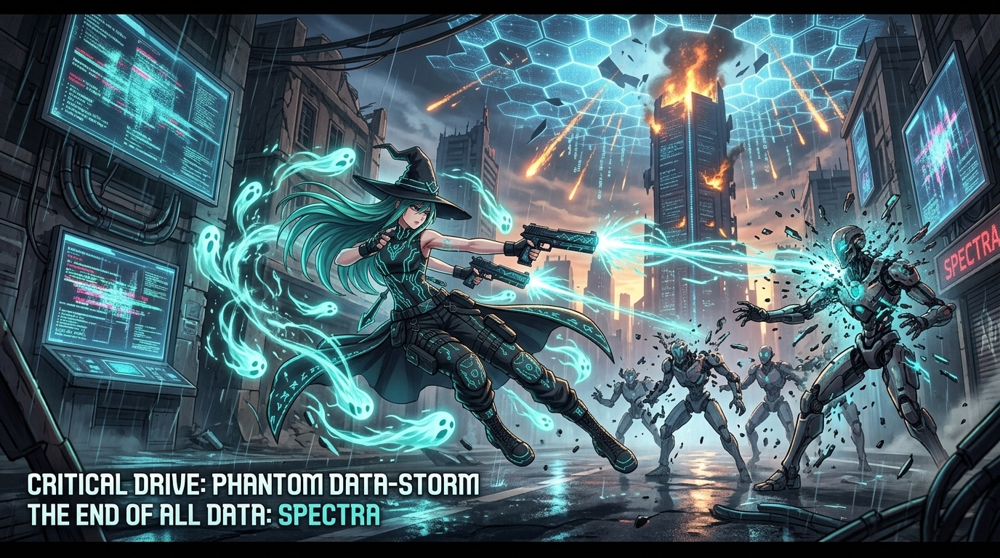

  - Standalone: [`assets/Spectra.jpg`](../apps/vantage-strike/public/assets/Spectra.jpg)
  - Portrait: [`assets/Spectra_Portraits/p_1778866744231.png`](../apps/vantage-strike/public/assets/Spectra_Portraits/p_1778866744231.png)
  - Scene bar: [`assets/Spectra_Bars/scene_1778877375231.png`](../apps/vantage-strike/public/assets/Spectra_Bars/scene_1778877375231.png)
- **Intel:**
  - ⬜ Backstory:
  - ⬜ Personality:
  - ⬜ Quotes:
  - ⬜ Relationships:
  - ⬜ Combat-style narrative:

### 3.5 Hellshift — "Hellshift's Brawler"

- **Gem color:** `purples` | **Theme:** `#a855f7` / bright `#d8b4fe` / glow `rgba(168,85,247,.6)`
- **Archetype:** Brawler — sustain, army growth, per-army stats. Scales with **Str / Con**.
- **Signature class:** **Brawler** — *"Throws the first punch. Bigger armies that grow faster."* (`armyPerSecond: 2`)
- **Job medals (10):** Brawler · Juggernaut · Reaver · Pugilist · Gladiator · Brute · Colossus · Ironclad · Titan · War Master
- **Assets:** 20 portraits · 22 bars · 10 cinematic MP4s (`assets/Hellshift_Portraits/`, `assets/Hellshift_Bars/`, `assets/Starred/Hellshift_Starred/`); standalone JPG `assets/Hellshift.jpg`
- **Art preview:**

  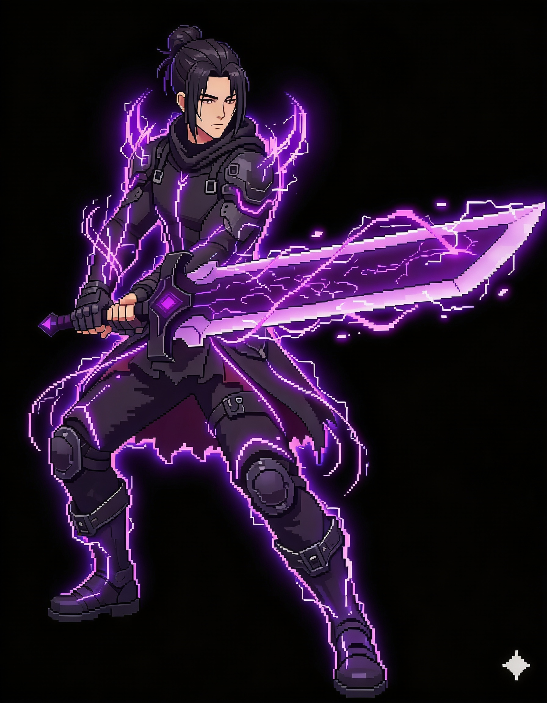
  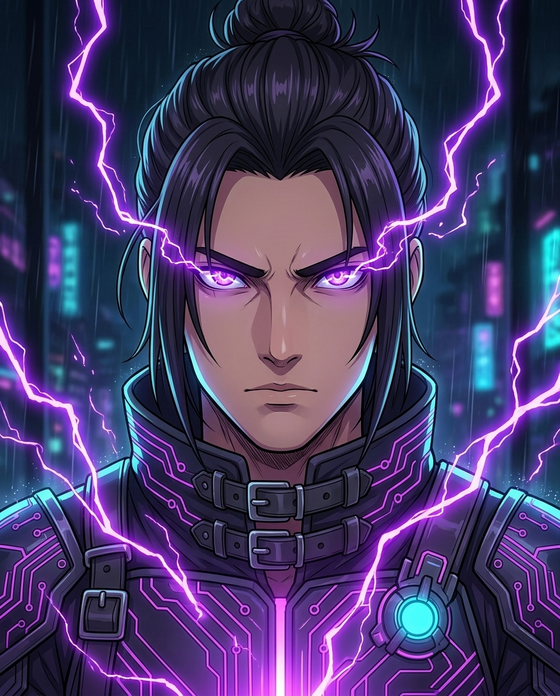
  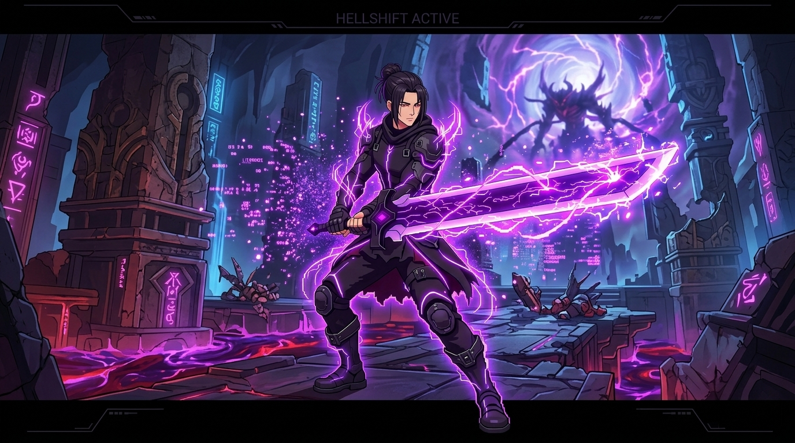

  - Standalone: [`assets/Hellshift.jpg`](../apps/vantage-strike/public/assets/Hellshift.jpg)
  - Portrait: [`assets/Hellshift_Portraits/p_1778869625436.png`](../apps/vantage-strike/public/assets/Hellshift_Portraits/p_1778869625436.png)
  - Scene bar: [`assets/Hellshift_Bars/scene_1778877332808.png`](../apps/vantage-strike/public/assets/Hellshift_Bars/scene_1778877332808.png)
- **Intel:**
  - ⬜ Backstory:
  - ⬜ Personality:
  - ⬜ Quotes:
  - ⬜ Relationships:
  - ⬜ Combat-style narrative:

### 3.6 Kailin — "Kailin's Executor"

- **Gem color:** `blacks` | **Theme:** `#6b7280` / bright `#d1d5db` / glow `rgba(107,114,128,.6)`
- **Archetype:** Executor — endgame, stat growth, idle damage, vantage cap. Scales with **total stats** (jack of all trades).
- **Signature class:** **Executor** — *"Passes final judgment. Gains stats per completion and amplifies idle damage."* (`statPerCompletion: 0.04`)
- **Job medals (10):** Executor · Voidcaller · Doombringer · Judge · Harbinger · Reaper · Inquisitor · Fallen · Eclipse · Death
- **Assets:** 22 portraits · 22 bars · 10 cinematic MP4s (`assets/Kailin_Portraits/`, `assets/Kailin_Bars/`, `assets/Starred/Kailin_Starred/`)
- **Art preview:**

  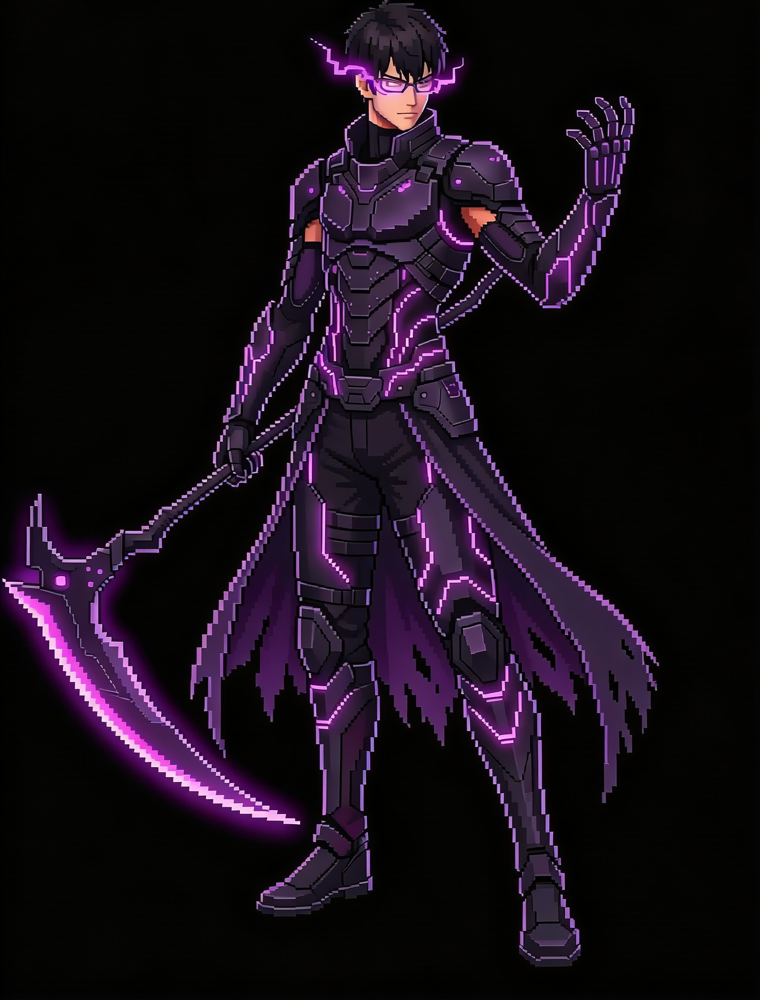
  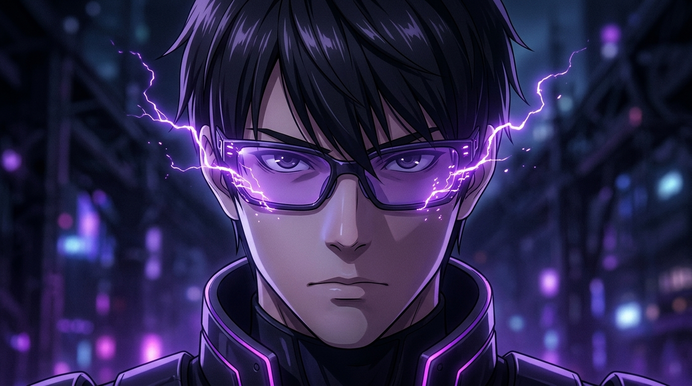
  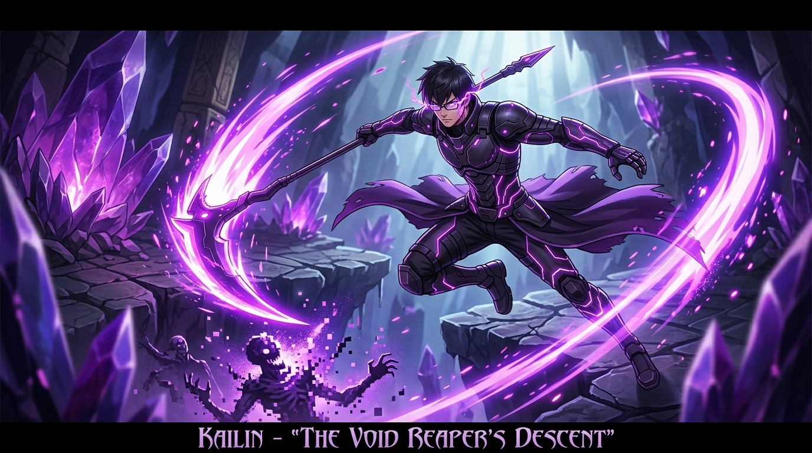

  - Standalone: [`assets/Kailin.jpg`](../apps/vantage-strike/public/assets/Kailin.jpg)
  - Portrait: [`assets/Kailin_Portraits/p_1778866978646.png`](../apps/vantage-strike/public/assets/Kailin_Portraits/p_1778866978646.png)
  - Scene bar: [`assets/Kailin_Bars/scene_1778877350796.png`](../apps/vantage-strike/public/assets/Kailin_Bars/scene_1778877350796.png)
- **Intel:**
  - ⬜ Backstory:
  - ⬜ Personality:
  - ⬜ Quotes:
  - ⬜ Relationships:
  - ⬜ Combat-style narrative:

---

## 4. Webpage Implementation Plan (Vue page in the game)

### 4.1 View wiring (no router — `v-if` pattern)
- Add `showProfiles` ref (default `false`) in `App.vue`.
- Add a `[Profiles]` header button (styled like existing `[G]` / `[?]` / `[Tutorial]` buttons) toggling it.
- Render `<CharacterProfileView v-if="showProfiles" @close="showProfiles = false" />` as a full-page view (not a modal), consistent with existing view toggles.

### 4.2 Components
- **`src/components/CharacterProfileView.vue`** (`<script setup lang="ts">`) — page shell:
  - Roster selector: 6 faction-colored tabs (name + title).
  - Active character profile: portrait, name/title, theme accents.
  - Sections: Attributes (5 stat bars via `.z-pbar`) · Signature Class · Job Medals grid · Intel panel.
- Optional **`CharacterProfileCard.vue`** — one character's detail block (header + attributes + medals), reused per selection.

### 4.3 Data sources (import from configs — no duplication)
| Data | Source |
|---|---|
| Theme tokens (color/bright/glow) | `heroThemes` from `gameData.ts` |
| Gem color + label | `gemColorInfo` from `gameData.ts` |
| Signature class name + desc | `classDefinitions` (archetype ids: `vanguard`, `tactician`, `rogue`, `mystic`, `brawler`, `executor`) |
| 10 job medals | `JOB_MEDAL_DEFS[charName]` from `jobMedalData.ts` |
| Portrait + asset counts | `localImages[charName]` from `gameData.ts` |
| Faction theming | `applyTheme(el, name)` + `[data-faction]` from `cssScripts.ts` |

### 4.4 Theming & layout rules
- Call `applyTheme()` on the view root (watch + onMounted, mirroring `CharPopout.vue`).
- Use only design-system primitives: `.z-btn`, `.z-pbar`, `.z-badge`; `--hero-*` vars for accents.
- Stat display mirrors `CharPopout.vue` (Str/Spi/Int/Con/Dex bars, preferred-stat highlight optional).

### 4.5 Optional enhancements (not required for v1)
- Cinematic MP4 embed keyed off `VANTAGE_STRIKE_THRESHOLD` / `mp4Index` (`assets/Starred/<Name>_Starred/`).
- Standalone JPGs for **all 6 heroes** (`Voltkin.jpg`, `Ashbeam.jpg`, `Crypsis.jpg`, `Spectra.jpg`, `Hellshift.jpg`, `Kailin.jpg` at `assets/*.jpg`) as alternate hero art.

---

## 5. Verification Strategy

| Check | Method |
|---|---|
| 6 characters render with correct name/title/color | Open Profiles page, click each tab |
| Faction theming switches per selection | Verify `--hero-*` / `[data-faction]` applied |
| Medals + signature class match configs | Compare against `JOB_MEDAL_DEFS` / `classDefinitions` |
| Type-check passes | `npm run typecheck` (vue-tsc, no `.ts` import extensions) |
| Dev server boots | `npm run dev` |
| No raw hex in components | Grep new components for `#[0-9a-f]` hex literals |
| Close button returns to game | Click `✕` / `[Profiles]` toggle off |

---

## 6. Follow-ups (later sessions)
- ⬜ Fill in character intel (backstory, personality, quotes, relationships) from user.
- ⬜ Build the Vue page per §4 once intel is confirmed.
