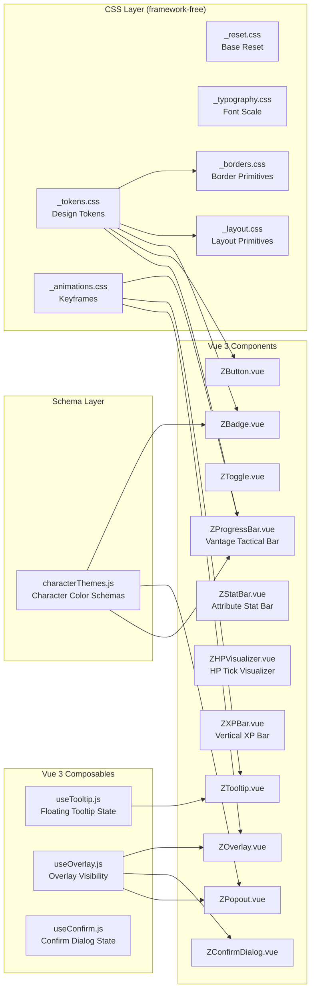
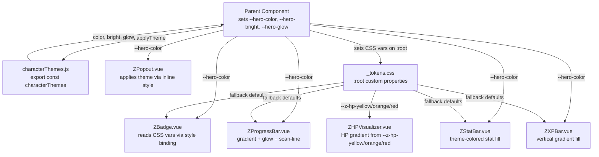

# Design System Extraction Plan

## Context & Assumptions

**Goal**: Extract the existing visual design patterns from the "Vantage Strike" game into a standalone, reusable design system for Vue 3/CSS that can be dropped into future projects.

**Scope**: All visual/CSS/Vue 3 patterns — borders, popouts, tooltips, fonts, sizing, colors, animations, badges, buttons, progress bars (horizontal + vertical), HP visualizers (tick-based gradient), XP bars, Vantage/tactical progress bars, overlays, toggle switches, layout primitives. NO images, NO videos.

**Output**: A standalone directory `design-system/` at project root, containing pure-CSS tokens/primitives + reusable Vue 3 composables + reusable Vue 3 components. Character-attached color schemas included as a dedicated file.

**Assumptions Locked**:
- Standalone copy-paste directory (not an npm package)
- Vue 3 + `<script setup>` composition API
- CSS custom properties for theming
- `monospace` is the primary semantic font family for labels/values
- Dark theme is the default (no light theme extraction needed)
- All components use scoped styles with CSS variables for theming
- Z-prefixed component names (e.g., `ZBadge`, `ZTooltip`) to avoid collisions

---

## Architecture Breakdown

> **Note**: CSS is a single file `design-system.css` (not multiple partials) for easier copy-paste into new projects.

### Domain Group 1: Design Tokens + CSS (`design-system.css`)

Single-file CSS containing all design tokens, reset, typography, animations, border primitives, and layout utilities.

```
design-system/
  design-system.css       # Single CSS file: tokens + reset + typography + animations + borders + layout
```

**Tokens to extract** (`_tokens.css`):
```css
:root {
  /* ── Background Colors ── */
  --z-bg-dark:          #030305;
  --z-bg-card:          #0d0d14;
  --z-bg-card-alt:      #0a0a12;
  --z-bg-overlay:       rgba(0,0,0,.7);
  --z-bg-tooltip:       rgba(10,10,18,.97);
  --z-bg-badge:         #000000d9;  /* near-black ~85% */
  --z-bg-input:         #0a0a12;
  --z-bg-bar:           rgba(0,0,0,.85);       /* XP bar bg */
  --z-bg-bar-track:     #000000f2;             /* tactical bar bg */

  /* ── Semantic Colors ── */
  --z-accent-purple:    #a855f7;
  --z-accent-bright:    #c084fc;
  --z-accent-glow:      rgba(168,85,247,.6);
  --z-accent-pink:      #d946ef;
  --z-accent-pink-glow: rgba(217,70,239,.5);
  --z-blue:             #3b82f6;
  --z-cyan:             #22d3ee;
  --z-gold:             #f59e0b;
  --z-red:              #ef4444;
  --z-green:            #22c55e;
  --z-gray:             #6b7280;

  /* ── HP Gradient Anchors (yellow → orange → red) ── */
  --z-hp-yellow:        #facd21;  /* full HP */
  --z-hp-orange:        #ef8844;  /* mid HP */
  --z-hp-red:           #ef4444;  /* low HP */

  /* ── Text Colors ── */
  --z-text-primary:     #e2e8f0;
  --z-text-secondary:   #64748b;
  --z-text-muted:       #94a3b8;
  --z-text-dim:         #334155;

  /* ── Border Colors ── */
  --z-border-default:   rgba(168,85,247,.3);
  --z-border-subtle:    rgba(168,85,247,.15);
  --z-border-muted:     rgba(168,85,247,.1);
  --z-border-faint:     rgba(168,85,247,.08);

  /* ── Font Families ── */
  --z-font-ui:          system-ui, sans-serif;
  --z-font-mono:        'JetBrains Mono', 'Fira Code', monospace;
  --z-font-tooltip:     'Segoe UI', system-ui, -apple-system, sans-serif;
  --z-font-mono-fallback: monospace;   /* fallback where JetBrains Mono unavailable */


  /* ── Border Radii ── */
  --z-radius-sm:        2px;
  --z-radius-md:        3px;
  --z-radius-lg:        4px;
  --z-radius-card:      6px;
  --z-radius-overlay:   8px;
  --z-radius-full:      50%;
  --z-radius-pill:      10px;

  /* ── Shadows ── */
  --z-shadow-card:      0 0 15px rgba(168,85,247,.08), inset 0 0 30px rgba(168,85,247,.03);
  --z-shadow-overlay:   0 0 40px rgba(168,85,247,.2), 0 0 80px rgba(168,85,247,.08);
  --z-shadow-tooltip:   0 0 20px rgba(0,0,0,.7), 0 4px 16px rgba(0,0,0,.5);
  --z-shadow-glow:      0 0 10px rgba(168,85,247,.4);
  --z-shadow-inner:     inset 0 0 4px rgba(168,85,247,.08);
  --z-shadow-badge:     0 0 8px rgba(168,85,247,.15), inset 0 0 4px rgba(168,85,247,.08);

  /* ── Z-Index Scale ── */
  --z-layer-base:       10;
  --z-layer-card:       10;
  --z-layer-header:     100;
  --z-layer-overlay:    500;
  --z-layer-modal:      600;
  --z-layer-confirm:    700;
  --z-layer-tooltip:    99999;    /* must be highest */

  /* ── Spacing Scale ── */
  --z-space-xs:         2px;
  --z-space-sm:         4px;
  --z-space-md:         6px;
  --z-space-lg:         8px;
  --z-space-xl:         10px;
  --z-space-2xl:        12px;
  --z-space-3xl:        14px;
  --z-space-4xl:        16px;

  /* ── Transitions ── */
  --z-transition-fast:  all .12s ease;
  --z-transition-base:  all .15s ease;
  --z-transition-slow:  all .25s ease;
}
```

### Domain Group 2: Character Color Schemas (`schemas/`)

Standalone JS/TS schema file for character-attached color themes — matches `heroThemes` + `gemColorInfo` from the current project.

```
design-system/
  schemas/
    characterThemes.js   # Character-attached color schemas
```

```js
// design-system/schemas/characterThemes.js
// Character-attached color schemas — copy this into your project and customize names/colors.
export const characterThemes = {
  Voltkin:  { color: '#ef4444', bright: '#fca5a5', glow: 'rgba(239,68,68,.6)', label: "Voltkin's Vanguard" },
  Ashbeam:  { color: '#3b82f6', bright: '#93c5fd', glow: 'rgba(59,130,246,.6)', label: "Ashbeam's Tactician" },
  Crypsis:  { color: '#f59e0b', bright: '#fde68a', glow: 'rgba(245,158,11,.6)', label: "Crypsis's Rogue" },
  Spectra:  { color: '#22d3ee', bright: '#a5f3fc', glow: 'rgba(34,211,238,.6)', label: "Spectra's Mystic" },
  Hellshift:{ color: '#a855f7', bright: '#d8b4fe', glow: 'rgba(168,85,247,.6)', label: "Hellshift's Brawler" },
  Kailin:   { color: '#6b7280', bright: '#d1d5db', glow: 'rgba(107,114,128,.6)', label: "Kailin's Executor" }
}

// Helper: set CSS custom properties on an element from a theme
export function applyTheme(el, theme) {
  el.style.setProperty('--hero-color', theme.color)
  el.style.setProperty('--hero-bright', theme.bright)
  el.style.setProperty('--hero-glow', theme.glow)
}
```

### Domain Group 3: CSS Primitives (`css/`)

**`_typography.css`** — Extracted font scale from the project:
- `.z-text-xs` — 6px (gem indices)
- `.z-text-sm` — 8-9px (badge labels, section titles)
- `.z-text-base` — 10px (stat badges)
- `.z-text-md` — 11-12px (body, header labels)
- `.z-text-lg` — 13-14px (card titles, damage popups)
- `.z-text-xl` — 16-18px (popout names, medal titles)
- `.z-font-mono` — Utility class for monospace
- `.z-text-uppercase` — Utility
- `.z-text-truncate` — Utility

**`_animations.css`** — Extracted keyframes:
- `z-fade-in` (0.15s) — overlay backgrounds
- `z-slide-in` (0.2s) — modal panels
- `z-pulse` (0.8-1.2s alternate) — glowing elements (overcore, rebirth)
- `z-pulse-green` (1.2s) — selected gem
- `z-scan-sweep` (3.5s) — tactical bar shimmer (shiny line moves L→R)
- `z-edge-pulse` (1s) — bar fill edge glow pulse
- `z-card-flash` (0.3s) — card on update
- `z-card-level-flash` (0.4s) — card on level
- `z-float-up` (0.6s) — damage popup float (scale + translate + fade out)
- `z-xp-fill` — XP bar gradient shimmer (optional)
- `z-hp-tick-flash` — HP tick flash on damage (optional)

**`_borders.css`** — Border primitives:
- `.z-border-card` — `1px solid var(--z-border-default)` + `border-radius: var(--z-radius-card)`
- `.z-border-overlay` — `1px solid var(--z-border-default)` + `border-radius: var(--z-radius-overlay)`
- `.z-border-section` — `1px solid var(--z-border-muted)` + `border-radius: var(--z-radius-lg)`
- `.z-border-input` — `1px solid var(--z-border-subtle)` + `border-radius: var(--z-radius-md)`
- `.z-border-badge` — `1px solid` (custom color) + `border-radius: var(--z-radius-md)`
- `.z-divider` — `height: 1px; background: var(--z-border-muted)`
- `.z-corner-accent` — before/after pseudo for top-left / bottom-right corner brackets

**`_layout.css`** — Layout primitives:
- `.z-view` — max-width 780px, centered
- `.z-card-row` — flex row, 155px min-height
- `.z-scroll-y` — overflow-y auto, hidden scrollbar
- `.z-flex-center` — flex justify+align center
- `.z-flex-between` — flex justify-between

### Domain Group 4: Vue Composables (`composables/`)

**`useTooltip.js`** — Extracted from `useGemTooltip.js`:
- State: `visible`, `content`, `x`, `y`, `isTouch`
- Actions: `showTooltip()`, `hideTooltip()`, `updatePosition()`
- Pure event-driven, no DOM manipulation

**`useOverlay.js`** — Extracted from overlay patterns:
- State: `visible`, `closable`
- Actions: `open()`, `close()`, `toggle()`
- Handles: backdrop click, escape key

**`useConfirm.js`** — Extracted from reset/trash confirm patterns:
- State: `showConfirm`, `message`
- Actions: `prompt()`, `confirm()`, `cancel()`

### Domain Group 5: Vue Components (`components/`)

All components accept `--hero-color`, `--hero-bright`, `--hero-glow` CSS vars via the root element for per-character theming.

| Component | Description | Extracted From |
|-----------|-------------|----------------|
| `ZBadge.vue` | Mini stat/level badge — dark bg, colored border, monospace | `portrait-level-badge`, `vantage-badge`, `overcore-badge`, `completion-badge`, `stat-item` |
| `ZButton.vue` | Versatile button — mini, gradient, danger variants | `btn-plus`, `cheat-btn`, `rebirth-btn`, `new-game-btn` |
| `ZToggle.vue` | Toggle switch — on/off with sliding circle | `toggle-switch` (SettingsOverlay) |
| `ZProgressBar.vue` | Horizontal fill bar — gradient fill, outer glow, scan-line shimmer, edge-pulse | `tactical-bar-fill` (Vantage progress bar in GameCard) |
| `ZStatBar.vue` | Thin stat bar — for attribute rows (Str/Spi/Int/Con/Dex), bar-bg + bar-fill | `stat-bar-bg`/`stat-bar-fill` in CharPopout and StatSlidePanel |
| `ZHPVisualizer.vue` | Vertical tick-based HP bar — N ticks, per-tick gradient color, depleted/partial/full states | `hp-visualizer-frame` + `hp-visualizer-inner` + `hp-tick` in GameCard (`src/style.css` lines 436-501, `GameCard.vue` lines 71-92) |
| `ZXPBar.vue` | Vertical XP fill bar — portrait-adjacent 5px-wide bar with gradient fill and glow | `portrait-xp-bar` + `portrait-xp-fill` in GameCard (`src/style.css` lines 102-120) |
| `ZOverlay.vue` | Modal backdrop + centered panel — fade/slide animation | `char-popout-overlay`, `settings-overlay`, `reset-confirm-overlay` |
| `ZConfirmDialog.vue` | Confirm/cancel dialog — red-tinted for destructive actions | `reset-confirm-box`, `trash-confirm-box` |
| `ZTooltip.vue` | Floating tooltip — viewport-clamped, teleported to body | `GemTooltip.vue` |
| `ZPopout.vue` | Modal popout — full character detail overlay | `CharPopout.vue` |

---

## Execution Sequence

### Bar Visual Patterns Deep-Dive

Four distinct bar visual systems identified:

**1. Vantage/Tactical Progress Bar (`ZProgressBar.vue`)**
- Track: `16px` height, `#000000f2` bg, `1px solid rgba(168,85,247,.25)` border, `border-radius: 2px`, inset shadow
- Fill: gradient L→R (color → bright → color), `box-shadow: 0 0 18px glow, inset 0 0 8px #ffffff26`
- Scan-line shimmer: `:after` pseudo-element, 40px-wide gradient strip, `animation: z-scan-sweep 3.5s ease-in-out infinite`
- Edge pulse: `:before` pseudo-element, 6px wide blur at right edge, `animation: z-edge-pulse 1s ease-in-out infinite alternate`
- CSS: `src/style.css` lines 237-293, template in `GameCard.vue` lines 304-320

**2. HP Visualizer (`ZHPVisualizer.vue`)**
- Container: 39px wide, flex column, no border/padding
- Tick count: configurable (default 15, `HP_TICK_COUNT` in gameData.js)
- Each tick: `flex: 1`, `min-height: 2px`, `border-radius: 2px`
- Gradient: `HP_GRADIENT_ANCHORS` — yellow `#facd21` (top/full) → orange `#ef8844` (mid) → red `#ef4444` (bottom/depleted)
- State per tick: full color, partial width (fractional bar), depleted black `#000`
- Top badge: enemy HP number, monospace, centered above bar, `#fca5a5` color
- CSS: `src/style.css` lines 436-501, template + computed `hpTicks` in `GameCard.vue` lines 71-92 and 401-414

**3. XP Bar (`ZXPBar.vue`)**
- Positioned: absolute, top 0, left 1px, `5px` width, `100%` height
- Track: `rgba(0,0,0,.85)` bg, `border-radius: 2px`, overflow hidden
- Fill: gradient 0deg (color → bright → bright → white), `box-shadow: 0 0 12px color + 88, inset 0 0 6px #fff3`
- Height: computed from hero.xp / hero.maxXp (0-100%)
- Transition: `height 0.2s ease`
- CSS: `src/style.css` lines 102-120, template in `GameCard.vue` lines 223-238

---

## Execution Sequence

### Step 1: Create directory structure
```
design-system/
  design-system.css           # Single CSS file
  schemas/
    characterThemes.js
  composables/
    useTooltip.js
    useOverlay.js
    useConfirm.js
  components/
    ZBadge.vue
    ZButton.vue
    ZToggle.vue
    ZProgressBar.vue          # Horizontal progress bar (Vantage/tactical style)
    ZStatBar.vue              # Thin horizontal stat bar (attributes row)
    ZHPVisualizer.vue         # Vertical tick-based HP bar
    ZXPBar.vue                # Vertical XP fill bar
    ZOverlay.vue
    ZConfirmDialog.vue
    ZTooltip.vue
    ZPopout.vue
  README.md
```

### Step 2: Write `design-system.css` — Single file containing all CSS
- Design tokens (colors, spacing, radii, shadows, z-index, transitions, fonts)
- Reset (universal selector, body, images, scrollbar)
- Typography (font family utilities, type scale 6px→18px, weight scale, uppercase, truncate)
- Animations (fade-in, slide-in, pulse, pulse-green, scan-sweep, edge-pulse, card-flash, card-level-flash, float-up)
- Border primitives (.z-border-card, .z-border-overlay, .z-border-section, .z-border-input, .z-border-badge, .z-divider, .z-corner-accent)
- Layout primitives (.z-view, .z-header, .z-content-row, .z-card-row, .z-scroll-y, flex utilities, gap utilities)

### Step 9: Write `schemas/characterThemes.js`
- Export characterThemes object
- Export applyTheme() helper

### Step 10: Write `composables/useTooltip.js`
- Extracted pattern from `useGemTooltip.js`
- Reactive state + methods

### Step 11: Write `composables/useOverlay.js`
- Generic overlay visibility management

### Step 12: Write `composables/useConfirm.js`
- Confirmation dialog state management

### Step 13: Write `components/ZBadge.vue`
- Props: themeColor, themeBright, label, value, size, borderColor
- Computed styles from CSS vars
- Slots for custom content

### Step 14: Write `components/ZButton.vue`
- Props: variant (mini|gradient|danger|ghost), size, disabled
- Scoped styles with hover/active states

### Step 15: Write `components/ZToggle.vue`
- Props: modelValue (v-model compatible)
- Toggle slider animation
- On/off color states

### Step 9 (renumbered): Write `design-system.css` — Already completed (Steps 2-8 merged into a single step above)

### Step 10-12: Write composables — Already completed (useTooltip.js, useOverlay.js, useConfirm.js)

### Step 13-23: Write components — All 11 Vue components already written:
- ZBadge, ZButton, ZToggle, ZProgressBar, ZStatBar, ZHPVisualizer, ZXPBar, ZOverlay, ZConfirmDialog, ZTooltip, ZPopout

### Step 20: Write `components/ZOverlay.vue`
- Props: visible, closable, zIndex
- Teleport to body
- Backdrop click, escape key handling
- Fade-in animation

### Step 21: Write `components/ZConfirmDialog.vue`
- Extends ZOverlay
- Props: title, message, confirmText, cancelText, danger (boolean)
- Emits: confirm, cancel

### Step 22: Write `components/ZTooltip.vue`
- Props: visible, x, y, content, inline (boolean)
- Viewport clamping logic
- Teleport to body
- Hover + touch modes

### Step 23: Write `components/ZPopout.vue`
- Extends ZOverlay
- Props: title, theme
- Header with close button, slot for body
- Slide-in animation

### Step 24: Write `README.md`
- Usage guide, import examples, customization docs
- Include examples for all bar components (ZProgressBar with scan-line, ZHPVisualizer with tick gradient, ZXPBar with vertical fill, ZStatBar for attribute rows)

---

## Verification Strategy

| Step | Verification |
|------|-------------|
| Step 2-8 (CSS) | Open `index.css` in browser, verify no syntax errors via CSS validator |
| Step 9 (schemas) | Import in a test file, log `characterThemes.Voltkin.color === '#ef4444'` |
| Step 10-12 (composables) | Write a test script: `showTooltip({...})`, verify `visible.value === true` |
| Step 13 (ZBadge) | Mount with `themeColor="#ef4444"`, verify CSS vars propagate |
| Step 14 (ZButton) | Mount each variant (mini, gradient, danger, ghost), verify hover/active transitions |
| Step 15 (ZToggle) | Toggle v-model, verify `.on` class applied, slider animates L→R |
| Step 16 (ZProgressBar) | Set `value=50, animated=true`, verify width=50%, scan-line + edge-pulse play |
| Step 17 (ZStatBar) | Set `value=75`, verify thin bar fills correctly, no animation |
| Step 18 (ZHPVisualizer) | Set `hpPercent=0.6, tickCount=15`, verify: top 9 ticks colored, 6 bottom ticks black, middle tick partial width |
| Step 19 (ZXPBar) | Set `value=65`, verify vertical fill at 65% height, gradient matches themeColor |
| Step 20 (ZOverlay) | Set `visible=true`, verify Teleport to body, backdrop click emits 'close' |
| Step 21 (ZConfirmDialog) | Click confirm → emits 'confirm', click cancel → emits 'cancel' |
| Step 22 (ZTooltip) | Set `visible=true, x=100, y=100`, verify position clamped within viewport |
| Step 23 (ZPopout) | Mount with title, verify slide-in animation plays, close button works |
| Step 24 (README) | Verify all import paths are correct, run example code for each component |

**Global verification**: Create a demo page at `design-system/demo.html` that imports all CSS and mounts all components, visually inspecting that each matches the original project's look.

---

## Mermaid Diagram: Architecture Overview



## Mermaid Diagram: Data Flow (Component → Token Resolution)


